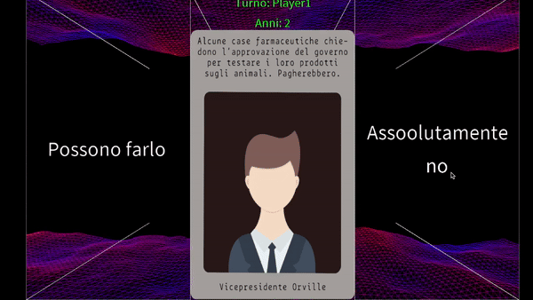

# Lapse Game
*Lapse game. Make the right choice for your country!*

This game a competitive and graphically advanced version of [Lapse Game](https://lapse.fandom.com/wiki/Lapse_(Game)) originally developed to entertain kids in summer camps🌞.

The main goal is to survive as long as possible, choosing the best option to let your country thrive on the 4 levels:
- Envirorment 🌱
- People 👫
- Army ⚔️
- Money 💰

# GamePlay

# Dependencies

This game is coded on **Processing 4** (Java-based graphic IDE), you can download it [here](https://processing.org/download).

# Running

To run the game follow this step:
- Clone this project: `git clone git@github.com:SangioAI/Lapse.git`
- Open this project on Processing 4 IDE.
- Run it.

# Commands

Use the following command to play:
- **K**: select left option.
- **L**: select Right option.
- **Space**: choose an option.
- **P**: Peek your country values.
- **O**: Oracle🧿, once an option is selected you can see the aftermaths before chosing it.
- **[1-6]**: cheatings in scoreboard, press the i-th number button to increase the years of the i-th player😉.

# Customizations

A number of things can be castomized
