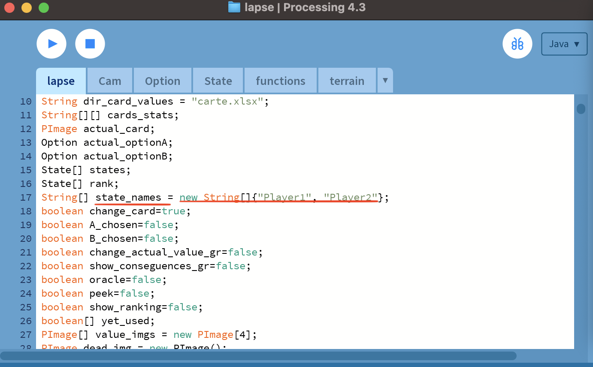
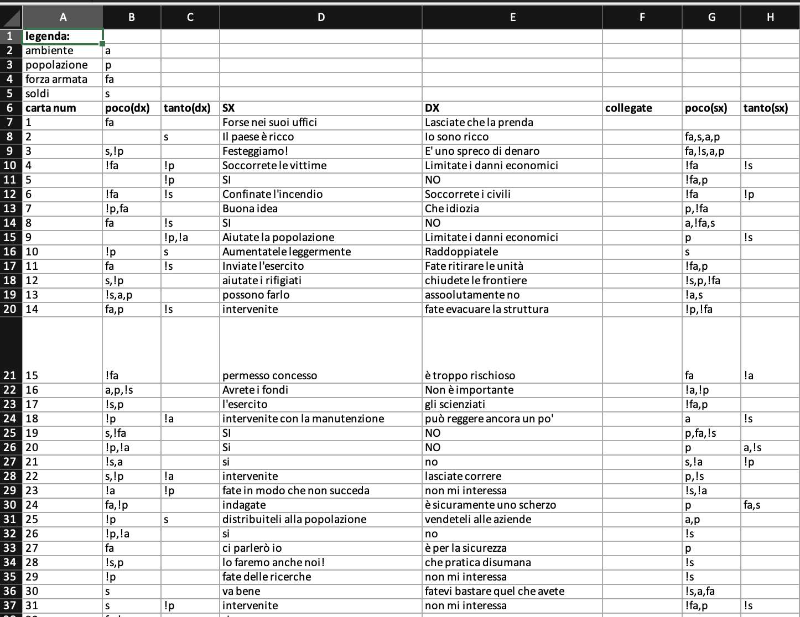

*Lapse game. Make the right choice for your country!*

This game is a competitive and graphically advanced version of [Lapse Game](https://lapse.fandom.com/wiki/Lapse_(Game)) originally developed to entertain groups of kids in summer camps🌞.

The main goal is to survive as long as possible, choosing the best option to let your country thrive on the 4 levels:
- Envirorment 🌱
- Population 👫
- Army ⚔️
- Money 💰

# GamePlay


# Dependencies

This game is based on **Processing 4** (Java-based graphic IDE), you can download it [here](https://processing.org/download).
<br/>
May also be the case to have [Java](https://www.java.com/en/download/) installed.

# Running

To run the game follow this step:
- Clone this project: `git clone git@github.com:SangioAI/Lapse.git`
- Open this project on Processing 4 IDE.
- Run it on Processing 4 IDE.

# Commands

Use the following command to play:
- **K**: select left option.
- **L**: select Right option.
- **Space**: choose an option.
- **P**: Peek your country values.
- **O**: Oracle🧿, once an option is selected you can see the aftermaths before chosing it.
- **[1-6]**: cheatings in scoreboard, press the i-th number button to increase the years of the i-th player😉.

# Customizations

A number of things can be castomized:
- Change the Players names: modify the variable `state_names`  in `lapse.pde`.
  
- Change the Cards images: change the images in `card_images`
> [!Note]
> Images file names must be consistent with those in `carte.xlsx`
- Change the Cards options: change the option in `carte.xlsx`
  <br/>
  ```
  Values:
    a => envirorment value
    p =>  population value
    fa =>  military force value
    s =>  money value

  Value Chages:
    '!' means negative consequences (e.g. !a, !p, !fa, !s), while without is are meant to be positive (e.g. a, p, fa, s).

  Meaningful Columns:
    'carta num':  number of card in 'card_images' folder.
    '1° poco(dx)': values change of choosing LEFT option
    '1° tanto(dx)': values large changes of choosing LEFT option
    'SX': LEFT option caption
    'DX': RIGHT option caption
    '2° poco(dx)': values change of choosing RIGHT option
    '2° tanto(dx)': values large change of choosing RIGHT option

  ```
  


Translation to other languanges are highly appriciated!
  
